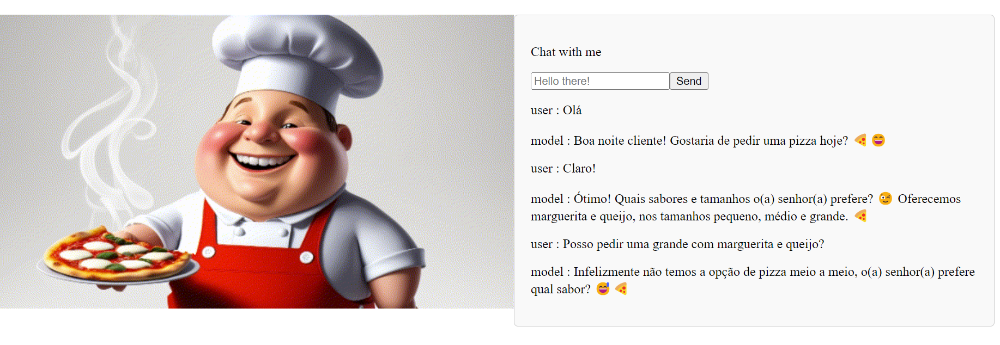

# Order a pizza with Gemini model created using Google API

This project uses React, Javascript, NodeJS, and Gemini to create a simple web chat.

To run this chat in the development mode to view it in your browser you have to open two terminals and run the following scripts in each of them in the following order:

1.npm run start:frontend
2.npm run start:backend
The page will reload when you make changes. This app will only work if you also create a '.env' file with your GOOGLE_GEN_API_KEY

GOOGLE_GEN_API_KEY=xxxxx

To get your API key, visit the Google website that contains the documentation, available at: https://ai.google.dev/gemini-api/docs/api-key

## 📒 Descrição

Essa IA atua como um atendente de pizzaria.

## 🤖 Tecnologias Utilizadas

Para fazer o pizzaiolo primeiro foi gerada uma imagem utilizando a ferramenta LeonardoAI que depois foi animada com ImmersityAI
O Gemini ele é responsável pela parte de interpretação e geração textuals

- [LeonardoAI](https://leonardo.ai/)
- [Gemini](https://ai.google.dev/gemini-api/)
- [ImmersityAI](https://app.immersity.ai/)

## 🧐 Processo de Criação

Descreva como você criou o conteúdo

## 💭 Reflexão (Opcional)

Comente sobre o desafio de criar algo 'natty' com IA.

#### Natural ou Fake Natty? Como Vencer na Era das IAs Generativas

### Exemplos e Insigths

- [E-BOOK](/exemplos/E-BOOK.md)
- [Podcast](/exemplos/PODCAST.md)
- [Vídeo (Avatar Virtual)](/exemplos/VIDEO.md)

## Links Interessantes

[Base10: If You’re Not First, You’re Last: How AI Becomes Mission Critical](https://base10.vc/post/generative-ai-mission-critical/)

